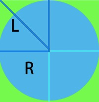

# 边框内圆角
需求：**元素边框外侧的四个角为直角，内侧的四个角为圆角，形成内圆角的效果**。
### 想法一
这个需求主要分为两部分，边框和圆角。实现边框跟圆角并不困难，只要使用border以及[border-radius](https://developer.mozilla.org/zh-CN/docs/Web/CSS/border-radius)属性即可：
#### 代码1
```css
border: 10px solid #67C23A;
border-radius: 10px;
```
实现效果如下：
<demo-1-4 />

通过上面的DEMO我们可以看到，最终实现的是外圆角内直角的效果，因为在设置border-radius的时候，是算上边框的。
### 想法二
前面有个章节提到过outline，那我们是否可以通过outline以及border-radius的方式来实现这个效果呢：
#### 代码2
```css
outline: 10px solid #67C23A;
border-radius: 10px;
```
具体效果如下所示：

<demo-1-4 :type="'type2'" />

实际效果距离我们的预期已经非常接近了，可是在元素的四个角还存在白色的空隙，那该怎么填上呢？答案是**box-shadow!**<br/>
在[多重边框](/views/CSS3Note/backgroundAndBorder/BAB-2.html)以及[box-shadow的妙用](/views/CSS3Note/201907/15.html)章节，我们知道可以利用box-shadow的偏移属性实现多重边框以及天气ICON等效果，在这里，我们可以利用它来实现这个效果：
#### 代码3
```css
outline: 10px solid #67C23A;
border-radius: 10px;
box-shadow 0 0 0 4px #67C23A
```
最后的效果如下所示：

<demo-1-4 :type="'type3'" />

那这个偏移量我们要设置多少合适呢？其实计算也非常简单。四个内圆角其实就是4个1/4圆:

通过勾股定理可以求得L = √2R，box-shadow需要设置的偏移量为L - R = (√2 - 1) * R，其中，R是border-radius的值。所以在上述例子中，偏移量的距离大概为：0.414 * 10 = 4px。


